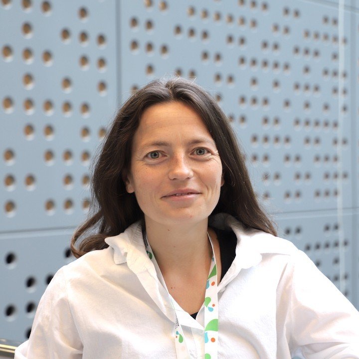

::: {.column-page}

::: {.hero}

::: {.hero-content}

BIOINFORMATICS · BIOMEDICAL DATA SCIENCE · SCIENTIFIC COMPUTING

# Angelika Merkel, PhD

## Connecting science, data and systems.

I work at the intersection of **biology, data, technology and people** — translating biological questions into the data, tools and systems needed to answer them.

My work spans **computational biology, scientific software and research infrastructure**, with a particular background in **epigenomics, hematopoiesis and cancer**.

:::

::: {.hero-visual}

  
  
  
  

  
  
  
  
  
  

:::

:::

## Areas of work

:::: {.columns}

::: {.column width="33%" .area-of-work .area-science}

<svg viewBox="0 0 64 64" aria-hidden="true">
  <path d="M20 6 C20 20, 44 20, 44 32 C44 44, 20 44, 20 58" />
  <path d="M44 6 C44 20, 20 20, 20 32 C20 44, 44 44, 44 58" />
  <line x1="23" y1="14" x2="41" y2="14" />
  <line x1="21" y1="23" x2="43" y2="23" />
  <line x1="21" y1="41" x2="43" y2="41" />
  <line x1="23" y1="50" x2="41" y2="50" />
</svg>

### Epigenomics & computational genomics

DNA methylation, gene regulation and genomic analysis across hematopoiesis, cancer and other biomedical research areas.

[Explore →](projects.qmd)

:::

::: {.column width="33%" .area-of-work .area-data}

<i class="bi bi-database" aria-hidden="true"></i>

### Bioinformatics infrastructure

Systems, processes and working practices that support bioinformatics teams and research facilities.

[Explore →](projects.qmd)

:::

::: {.column width="33%" .area-of-work .area-systems}

<i class="bi bi-gear" aria-hidden="true"></i>

### Scientific software & workflows

Tools and reproducible workflows for genomic data analysis, FAIR metadata capture and research data access.

[Explore →](projects.qmd)

:::

::::

## Writing

:::: {.columns}

::: {.column width="50%" .writing-item}

### Building Bioinformatics

WHAT I'VE LEARNED

Practical thoughts on bioinformatics, software engineering, reproducibility, workflows and research computing infrastructure.

[Read Building Bioinformatics →](https://angemerkel.github.io/building-bioinformatics/)

:::

::: {.column width="50%" .writing-item}

### Catching up with AI

WHAT I'M LEARNING

Notes and experiments from exploring machine learning, generative AI and their potential role in biomedical research and beyond.

[Explore Catching up with AI →](https://angemerkel.github.io/catching-up-with-ai/)

:::

::::

::: {.site-links}

[GitHub](https://github.com/angemerkel) ·
[LinkedIn](https://www.linkedin.com/in/angelika-merkel-05813085/) ·
[ORCID](https://orcid.org/0000-0001-5164-6803)

:::

:::